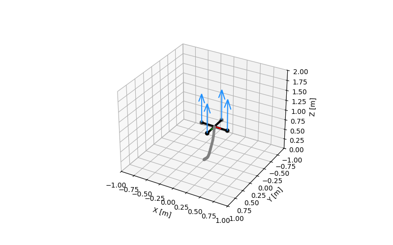
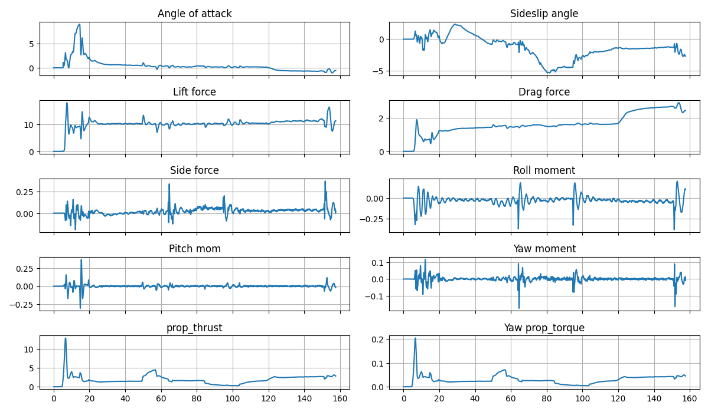
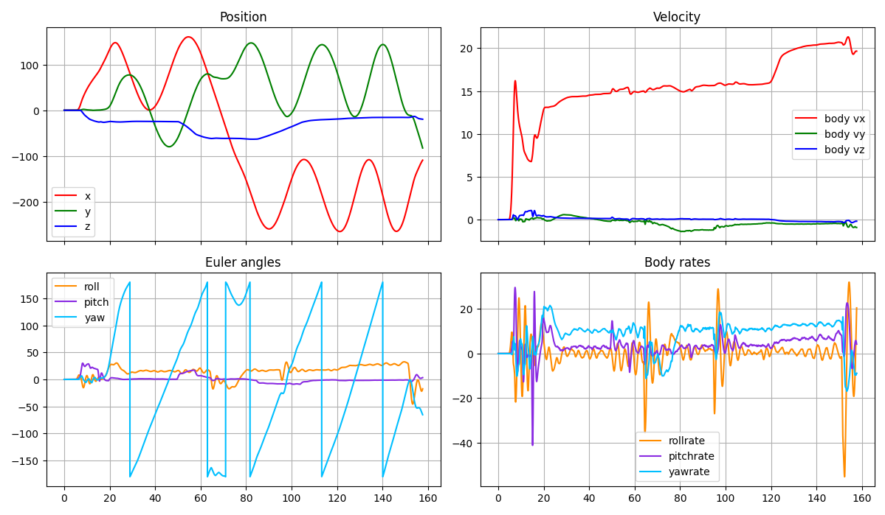
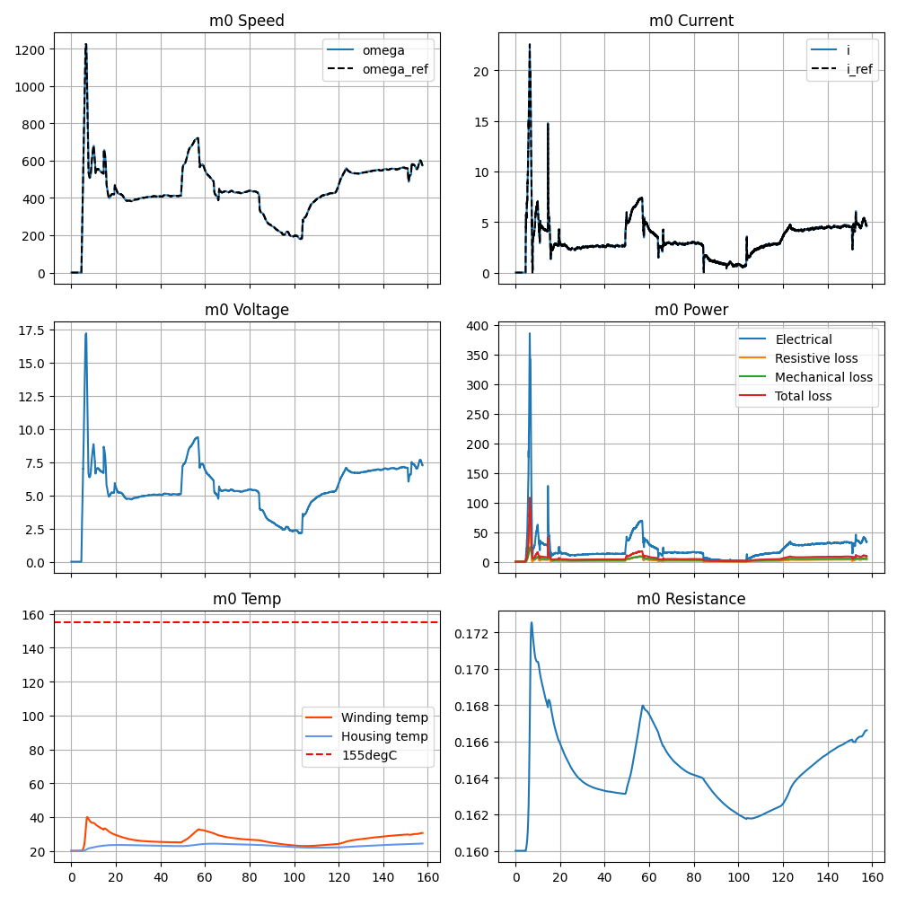
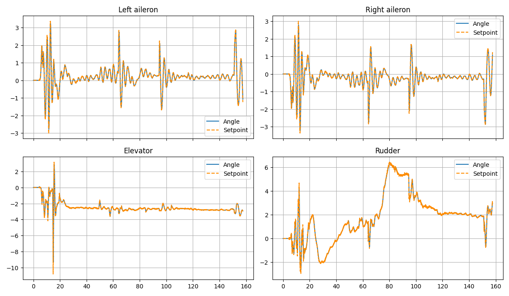

# AeroSim (temp)

Python-based aero vehicle sandbox for multicopter and fixed-wing simulation, built for rapid iteration, logging, and PX4 SITL integration.



- 6-DoF rigid-body dynamics with selectable integrators (Euler, RK4).
- Vehicle stack for multicopter and fixed-wing, including propeller, motor, battery, and ground models.
- Sensor suite (IMU, mag, baro, GNSS, airspeed) with noise, bias, limits, and per-sensor update rates.
- PX4 SITL bridge using MAVLink for HIL-style sensor feeds and actuator commands.
- Built-in plotting and Matplotlib/Unity visualisation hooks for fast debugging.

## Quick Start
1. Create a Python 3.9+ environment and install the basics:  
   `pip install numpy pandas matplotlib pymavlink`
2. Run the simulator (defaults set in `run_sim.py`):  
   `python run_sim.py`
3. Adjust the scenario by editing `run_sim.py` (vehicle type, parameters, controller, visualisation, real-time).

## Highlights






## Core Models
- **Vehicle dynamics:** `model/vehicle` for multicopter and fixed-wing dynamics.
- **Actuators:** `model/actuator` with DC motor and control surface models.
- **Propulsion:** `model/propeller` and motor controllers in `controller/`.
- **Environment:** `model/ground` and shared constants/utilities in `common/`.
- **Sensors:** `model/sensor` with IMU, mag, baro, GNSS, and airspeed instruments.

## Parameters and Data
- JSON parameter sets in `parameter/` for vehicles, motors, motor controllers, and propellers.
- Logs saved to `output/` with plotting utilities in `plot.py` and `open_plot.py`.
- Example quad parameters in `parameter/multicopter/test_quad.json`.

## Repository Layout
```
.
├── README.md
├── README_TEMP.md
├── common/                 # Shared constants and utils
├── controller/             # PID and motor velocity controllers
├── images/                 # Visuals used in this README
├── model/                  # Vehicle, actuator, sensor, and environment models
├── parameter/              # JSON configs for vehicles/motors/props
├── test/                   # Unit tests for dynamics components
├── visualisation/          # Matplotlib and Unity visualisation hooks
├── integrator.py           # Euler/RK4 integrators
├── logger.py               # Structured logging
├── mavlink_util.py         # PX4 SITL helpers
├── plot.py                 # Plotting helpers
├── run_sim.py              # Main simulation entry point
└── simulator.py            # Simulation loop wrapper
```
